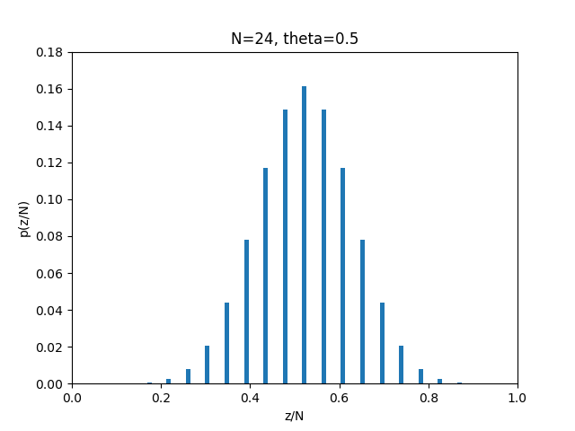
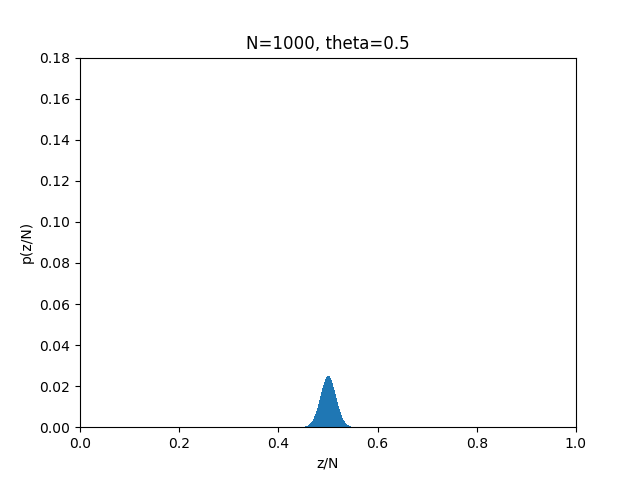
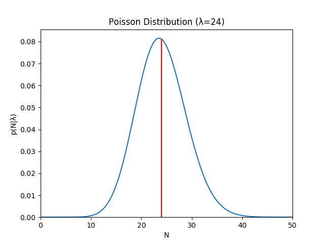

## ベイズ統計モデリング輪読会#6
### 第11章 帰無仮説有意性検定
 
Yusuke Goto

========================================
### Outline
- - -
1. 自己紹介

1. 11-1章 善意で舗装された道

1. 11-2章 事前分布

1. 11-3章 信頼区間と最高密度区間

1. 11-4章 多重比較

1. 11-5章 サンプリング分布が役に立つこと

========================================
### 自己紹介
- - -
- 名前： 　 後藤雄介

- 勤務先：　車メーカー（昨年12月に転職）

- 機械学習：転職してから勉強開始。元々確率論が好き

- 勉強会：　参加したのはここが初めてです。発表は人生初

========================================
## 　　　11-1章 善意で舗装された道
### 　　　　　　〜ここがヘンだよNHST〜

========================================
### 帰無仮説有意性検定(NHST)とは？
- - -
Null Hypothesis Significance Testingの略。 
頻度主義の手法であり、次の手続きで行われる。

1. 検証したい帰無仮説を設定する 
「コインの表が出る確率$\theta$は$0.5$である」

1. $p$値を計算する 
※$p$値の意味と計算方法は後述

1. $p$値が閾値より小：仮説は棄却 
$p$値が閾値より大：仮説は棄却されない

========================================
### 得られたデータの「極端さ」の指標：$p$値
- - -
$p$値の定義：ある帰無仮説が正しい場合に、実際にサンプリングされたデータよりもさらに「極端」なデータが得られる確率

$$
p値 =p\(D\_{\theta,I} \succeq D\_{実際}|\theta,I\) \\
$$
 
$D$: 記述統計量。コインの場合は(表の出た回数$z$)/(コイントス回数$N$) 
$I$: サンプリング方法を決める意図(後述) 
$\succeq$:左の$D$が右の$D$よりも「極端である」ことを表す 

コイントスの場合を具体的に書くと
\begin{eqnarray}
p\(右端\)=p\( (z/N)\_{\theta,I} \ge (z/N)\_{実際} |\theta,I\)
\\\
p\(左端\)=p\( (z/N)\_{\theta,I} \le (z/N)\_{実際} |\theta,I\)
\end{eqnarray}

========================================
### 3種類のサンプリング意図$I$ごとに$p$値を計算してみる
- - -
実験者「$\theta=0.5$だと思うんだけど、実験してくれない？」 
助手　「分かりました。」 
　　　（$2$分後） 
助手　「実験の結果でました。こんな感じです。 
　　　　裏裏表表裏裏表裏裏裏裏裏裏裏裏裏表裏裏表表裏裏表」 
実験者「$24$回中$7$回表が出たわけか。 
　　　　トスの回数はどういう意図で決めたの？」 

助手の意図として、次のパターンを考えてみる 
1. 「$24$回トスしたらやめよう、と最初から決めてました。」 
1. 「$7$回表が出たらやめよう、と最初から決めてました。」 
1. 「制限時間の$2$分になったらやめよう、最初から決めてました。」 

----------------------------------------
### サンプリング空間
- - -
サンプリング意図を細かく気にする理由は、 
意図次第でサンプリング空間が変わるから！

========================================
### 意図1:トス回数$N$を固定した場合(1/2)
- - -
$N$を固定した時に表が$z$回出る確率は、次の二項分布に従う。
$$
p(z|N,\theta)=
\begin{pmatrix}
N \\\
z
\end{pmatrix}
\theta^z
\(1-\theta\)^{N-z}
$$

$p$値はグラフ中の+矢印部分を足しあげた値$3.2\%$となる。
<!-- ここにグラフ入れる -->

----------------------------------------
### $p$値計算時の注意
- - -
$p$値は
$$
p(z=7|N=24,\theta=0.5)=2.063\%
$$
ではなく
$$
\sum_{z=1}^{7} p(z|N=24,\theta=0.5)=3.2\%
$$
が正しい。単一の$z$の確率だけでは極端さを評価できないため。

例えば$N=1000$の場合は、$\theta=0.5$が正しかったとしても$z=500$となる確率は$2.5\%$だが、明らかにこの値の小ささだけで極端と判定すべきではない。

----------------------------------------
### 実際にプロット比較してみた
- - -

========================================
### 意図1:トス回数$N$を固定した場合(2/2)
- - -
慣習的に臨界確率は両側$5\%$を使う。

今回は$z/N$が極端に小さいかどうか（＝分布の左裾側に外れているか）を検定したいので、片側確率$2.5\%$と比較する。

$p=3.2\%>2.5\%$より、帰無仮説「$\theta=0.5$」の元で$z=7$は極端とは判定されない。
よって、帰無仮説は棄却されない。 
(※「採択する」ほど強い主張ではない)
<!-- ここにグラフ入れる -->

========================================
### 意図2:表の回数$z$を固定した場合(1/2)
- - -
$N$回目のトスで$z$回目の表が出る
 
＝$N-1$回目までのトスで$z-1$回表が出ており、次のトスで表が出る
\begin{eqnarray}
p(N|z,\theta)
&=&
\begin{pmatrix}
N-1 \\\ z - 1
\end{pmatrix}
\theta^{z-1} (1-\theta)^{\\{(N-1)-(z-1)\\}}
\ \ \ \times \theta
\\\
&=&
\frac{z}{N}
\begin{pmatrix}
N \\\ z
\end{pmatrix}
\theta^{z} (1-\theta)^{N-z}
\end{eqnarray}

<!-- ここにグラフ入れる -->

========================================
### 意図2:表の回数zを固定した場合(2/2)
- - -
$p$値は$1.7\%$。片側閾値$2.5\%$より小さい。

つまり帰無仮説「$\theta=0.5$」が正しいと主張するには、得られたデータがあまりに極端。
仮説は棄却される。

さっきは棄却されなかったのに、
サンプリング意図が違うだけで結果が変わった！

----------------------------------------
### 実は、$z$を固定する方法はあまり良くない。
- - -
サンプリングの後半に出てくるかもしれない補償的なデータを捨てるので、バイアスがかかる。

========================================
### 意図3:制限時間を固定した場合(1/2)
- - -
この場合は$N$も$z$も共に確率変数。

発生確率一定の事象が決められた時間内で発生する回数はポアソン分布
$$
p(N|\lambda) = \frac{\lambda^{N}e^{-\lambda}}{N!}
\ \ \ \ \ \(N>0\)
$$
でモデル化する。(パラメタ$\lambda$は分布の平均。今回は$24$とする)
　　　　　　　　　

$N$はポアソン分布に従って決まり、各$N$に対する$z$が二項分布で決まるので、
$(N,z)$の分布は二項分布のポアソン重み付き和になる。

========================================
### 意図3:制限時間を固定した場合(2/2)
- - -

結果、$p$値は$2.4\%$となり、片側閾値$2.5\%$よりわずかに小さく帰無仮説「$\theta=0.5$」は棄却されるが、これを信じて良いものか？

今回は$N$の平均として$24$を設定したが、コイントス$1$回平均$6$秒とすれば平均は$20$とすべきで、その場合$p$値は$3.5\%$になる(検定結果が変わる)

さらに、ポアソン分布は$N=\infty$でも有限の値をもつが、$2$分間に$\infty$回コイントスはできない。 
→サンプル集合が変わってくる。他にもパラメタは色々ありうる

========================================
### 複数の検定を行う場合(1/2)
- - -
$N=24$固定でコイントスしたら、$7$回表が出た。
同じコインがもう$1$枚ある。
帰無仮説は同じ「$\theta=0.5$」

左側$p$値の定義：
\begin{eqnarray}
p\(
  \(z\_1/N\_1\)\_{\theta\_1,I\_1}
  \le
  (z\_1/N\_1\)\_{実際}
  あるいは
  \(z\_2/N\_2\)\_{\theta\_2,I\_2}
  \le
  (z\_1/N\_1\)\_{実際}
  |
  \theta\_1,\theta\_2,I\_1,I\_2
\)
\end{eqnarray}

$Extrem(A,B)$を$A$と$B$のうちより極端な場合とすると：
\begin{eqnarray}
p\(Extrem\\{
  \(z\_1/N\_1\)\_{\theta\_1,I\_1}
,
  \(z\_2/N\_2\)\_{\theta\_2,I\_2}
  \\}
  \le
  (z\_1/N\_1\)\_{実際}
  |
  \theta\_1,\theta\_2,I\_1,I\_2
\)
\end{eqnarray}

→$p$値はコイン$1$枚のときより大きくなる。 
　理由：$1$枚目が極端じゃなくてもまだ$2$枚目が極端な場合がある

========================================
### 複数の検定を行う場合(2/2)
- - -
実際に分布を見ると$\(z\_1/N\_1\)_{実際}=7/24$のときの$p$値は$6.3\%$。 
（※コイン$1$枚のときは$3.2\%$だった）

$\(z\_2/N\_2\)_{実際}$の値を決めていない点に注目。 

仮想的な可能性は、観測データではなくサンプリング意図で決まる。

$2$枚目のトス回数を$12$回に減らすだけで$p$値は$10.3\%$まで上昇。

========================================
### 意図によって変動する$p$値を信用していいものか
- - -
- $N$を十分に大きくすれば問題ないのでは？ 
→$N$が小さい時は何の情報も得られないことになるし、$N$が大きくとも$p$値が意図に大きく影響を受ける場合はある。

- 最初から$N$固定を意図していた、と常に考えればよいのでは？ 
→$z$固定などの他の意図を否定できていない。

意図に依存してしまう  NHSTではなく、観測データにのみ依存するベイジアン分析をやるべきである！

========================================
## 　　　　　　11-2章 事前分布
### 　　　　〜経験知識をモデルに組み込もう〜

========================================
### 事前知識の大切さ(1/2)
- - -
ここまでのNHSTモデルは、コインではなく釘の場合も全く同じ。

コインの表回数が$7/24$回の極端さと、釘表が$7/24$の極端さは同じか？

  
 
↑釘をトスしたときの「表」

<!-- 釘が立ってる画像 -->

========================================
### 事前知識の大切さ(2/2)
- - -
<!-- 図11.7 -->
事前知識は意図とは違い、経験データにとことん向き合って得られた明白かつ適切な知識である！

========================================
## 　　　11-3章 信頼区間と最高密度区間
### 　　　　〜頻度主義からの反論に対する反論〜

========================================
### 頻度主義からの反論：信頼区間の利用
- - -

信頼区間：NHSTで棄却されない帰無仮説の範囲

$N=24$固定で$z=7$が得られた時の$95\%$信頼区間は$\theta \[0.126,0.511\]$
<!-- 11.10 -->

========================================
### 信頼区間の利用
- - -

信頼区間を使っても、意図によって結果が変わる問題が残る。 
これは信頼区間の定義自体に$p$値が含まれているため、必然。

| No. | 意図 | $95\%$信頼区間 |
| --- | --- | --- |
| 1 | $N$固定 | $\[0.126,0.511\]$ |
| 2 | $z$固定 | $\[0.126,0.484\]$ |
| 3 | 時間固定 | $\[0.135,0.497\]$ |
| 4 | $N$固定でコイン$2$枚 | $\[0.110,0.539\]$ |

----------------------------------------
### 注意：信頼区間は$\theta$の「分布」ではない
- - -

実際、積分しても$1$にならない
<!-- p vs theta -->

========================================
### 信頼区間とベイズ最高密度区間(HDI)の違い
- - -

ベイズHDI（$4$章で登場）は、事後確率$95\%$を占める$\theta$の範囲。

利点は次の$3$つ

1. 「$p\(\theta|D\)$に基づく$\theta$の確信度」という意味付けが可能
1. 意図に依存しない
1. 事前の信念を取り込むことができる

----------------------------------------
### ：信頼区間は$\theta$の「分布」ではない
- - -

========================================
## 　　　　　　11-4章 多重比較
### 　　　　　　〜頻度主義よさようなら〜

========================================
### 信頼区間の利用
- - -

========================================
# 結論
 
### 帰無仮説ではなく、帰するべき事前分布を設定しよう！
### 　　　　　　　　　　　　　　　　　　　　〜おわり〜
