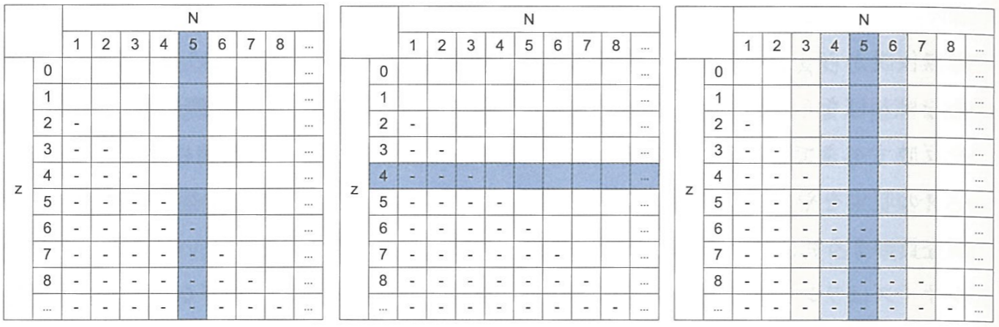
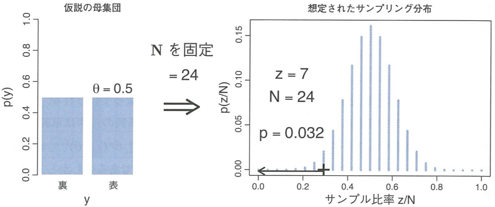
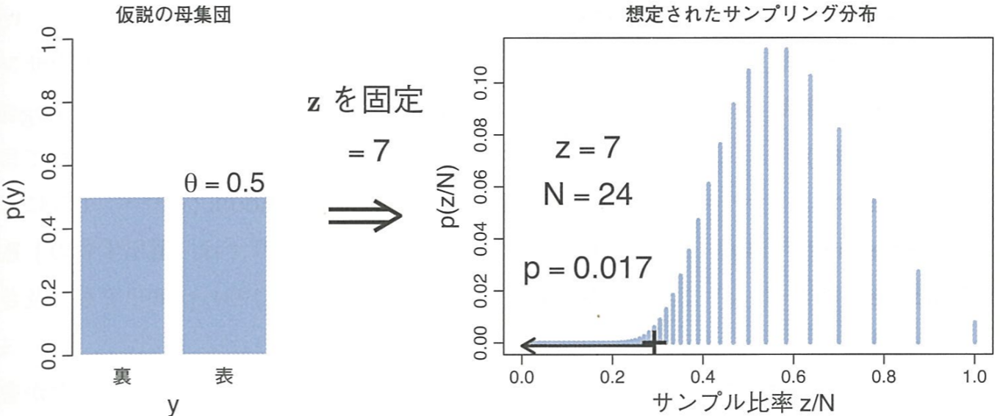
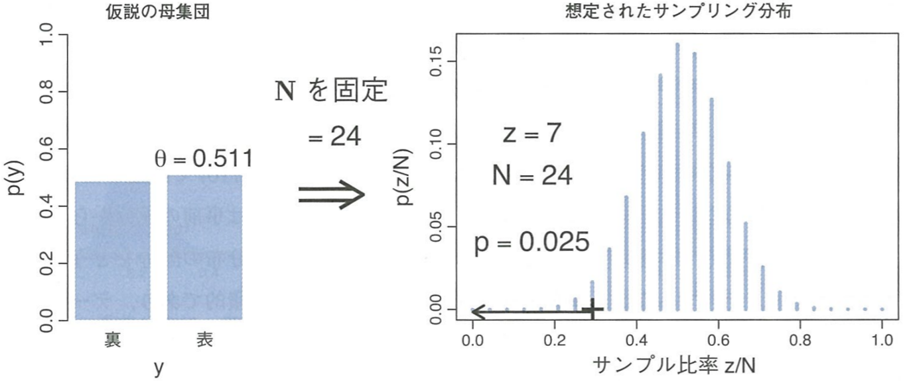
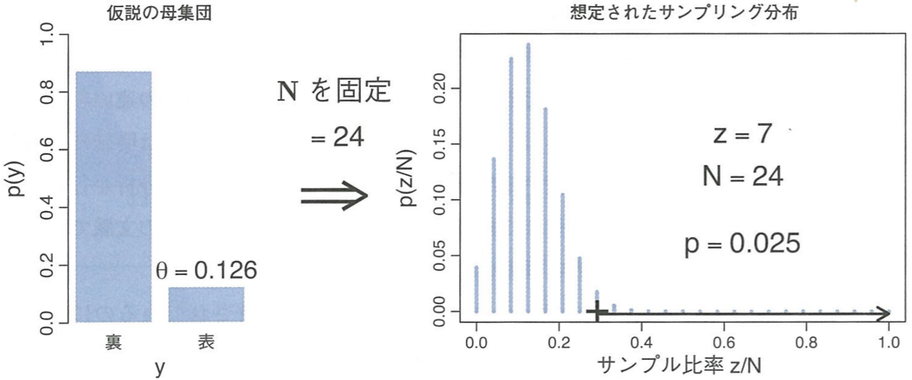



## ベイズ統計モデリング輪読会#6
## 第11章 帰無仮説有意性検定
 
yusuke goto

========================================
### Outline
- - -
1. 自己紹介

1. 11-1章 善意で舗装された道

1. 11-2章 事前分布

1. 11-3章 信頼区間と最高密度区間

1. 11-4章 多重比較

1. 11-5章 サンプリング分布が役に立つこと

========================================
### 自己紹介
- - -
- 名前：後藤雄介
  
- 勤務先：車メーカー（昨年12月に転職）
  
- 犬四匹本の抽象的で詩的な文体は、実はそんなに嫌いじゃないです
  
- 勉強会は初めて参加。発表も人生初なのでよろしくお願いします

========================================
## 　　　11-1章 善意で舗装された道
### 悪気はなくとも悪事を犯す、 そんな危険な橋は渡るべきではない。（by 小杉先生）

========================================
### 帰無仮説有意性検定(NHST)とは？
- - -
Null Hypothesis Significance Testingの略。 
頻度主義の手法であり、次の手続きで行われる。

1. 検証したい帰無仮説を設定する 
「コインの表が出る確率$\theta$は$0.5$である」

1. 実験してデータを集める 
「コイントス$24$回中、表が出たのは$7$回でした」

1. $p$値を計算する 
※意味と計算方法は後述

1. 帰無仮説を棄却するか判定する 
「$p$値が$2.5\%$より小さいので、仮説は棄却される」 
「$p$値が$2.5\%$より大きいので、仮説は棄却されない」

========================================
### 得られたデータはどの程度「極端」なのか
- - -
$p$値の定義＝ある帰無仮説が正しい場合に、実際にサンプリングされたデータよりもさらに「極端」なデータが得られる確率

$$
p値 =p\(D\_{\theta,I} \succeq D\_{実際}|\theta,I\) \\
$$

コイントスの場合を具体的に書くと

\begin{eqnarray}
p\(右端\)=p\( (z/N)\_{\theta,I} \ge (z/N)\_{実際} |\theta,I\)
\\\
p\(左端\)=p\( (z/N)\_{\theta,I} \le (z/N)\_{実際} |\theta,I\)
\end{eqnarray}

========================================
### 実際に$p$値を計算してみる
- - -
実験者「$\theta=0.5$だと思うんだけど、実験してくれない？」 
助手　「分かりました。」 
　　　（$2$分後） 
助手　「実験の結果が出ました。 
　　　　裏裏表表裏裏表裏裏裏裏裏裏裏裏裏表裏裏表表裏裏表」 
実験者「$24$回中$7$回表が出たわけか。 
　　　　トスの回数はどういう意図で決めたの？」 

助手の意図として、次のパターンを考える 
1. 「トス回数$N$が$24$になったらやめよう、と最初から決めてました。」 
1. 「表回数$z$が$7$になったらやめよう、と最初から決めてました。」 
1. 「$2$分たったらやめよう、最初から決めてました。」 

----------------------------------------
### サンプリング空間
- - -
サンプリング意図を細かく気にする理由は、 
意図次第でサンプリング空間が変わるから！

 
図11.2　想定されるサンプリング空間を青塗りにしたもの 
（左から$N$固定、$z$固定、時間固定）

========================================
### 意図1:トス回数$N$を固定した場合[1/2]
- - -
$N$を固定した時に表が$z$回出る確率は、次の二項分布に従う。
$$
p(z|N,\theta)=
\begin{pmatrix}
N \\\
z
\end{pmatrix}
\theta^z
\(1-\theta\)^{N-z}
$$

$7$回表が出た場合、$p$値$=p\(z\le7\)=3.2\%$となる。

 
図11.3　$N=24$固定のときに$z$回表が出る確率の分布

========================================
### 意図1:トス回数$N$を固定した場合[2/2]
- - -
$p$値と比較する閾値には、慣習的に両側$5\%$を使う。

今回は$z/N$が極端に小さいかどうか（＝分布の左裾側に外れているか）を検定したいので、片側確率$2.5\%$と比較する。

 

$p$値$=3.2\%>2.5\%$より、帰無仮説「$\theta=0.5$」は棄却されない。

(つまり、表の出た割合$7/24$は帰無仮説の$\theta=0.5$より小さいが 
  「$\theta=0.5$」が間違いだと言えるほどではない。)

========================================
### 意図2:表の回数$z$を固定した場合[1/2]
- - -
$N$回目のトスで$z$回目の表が出る確率は
 
$N-1$回目までのトスで$z-1$回表が出る確率$\ \times\ $表が出る確率

\begin{eqnarray}
p(N|z,\theta)
&=&
\begin{pmatrix}
N-1 \\\ z - 1
\end{pmatrix}
\theta^{z-1} (1-\theta)^{\\{(N-1)-(z-1)\\}}
\ \ \ \times \theta
\\\
&=&
\frac{z}{N}
\begin{pmatrix}
N \\\ z
\end{pmatrix}
\theta^{z} (1-\theta)^{N-z}
\end{eqnarray}

========================================
### 意図2:表の回数$z$を固定した場合[2/2]
- - -

$p$値$=1.7\%<2.5\%$なので、帰無仮説は棄却される。

(つまり、表の出た割合$7/24$は、帰無仮説「$\theta=0.5$」を正しいと主張できないくらい極端に小さい)

 

#### →サンプリング意図が変わると検定結果も変わる！

----------------------------------------
### 実は、$z$を固定する方法はあまり良くない。
- - -
サンプリングの後半に出てくるかもしれない補償的なデータを捨てるので、バイアスがかかる。

例： 
「コイントスの結果$1000$回中$500$回表が出たが、表は前半に偏った」

========================================
### 意図3:制限時間を固定した場合[1/2]
- - -
この場合は$N$も$z$も共に確率変数。

決められた時間内でのイベント発生回数はポアソン分布でモデル化。 
$$
p(N|\lambda) = \frac{\lambda^{N}e^{-\lambda}}{N!}
\ \ \ \ \ \(N>0\)
$$
(パラメタ$\lambda$は分布の平均。今回は$24$とする) 

$N$がポアソン分布で決まり、その$N$に対して$z$が二項分布で決まる。 
($z$が$N$に従属する階層ベイズモデル)

========================================
### 意図3:制限時間を固定した場合[2/2]
- - -

$p$値$=2.4\%<2.5\%$となり帰無仮説「$\theta=0.5$」は棄却されるが…
 
この検定結果を信じて良いのか？

サンプリング分布の考え方次第で
$p$値はいくらでも変動する。

========================================
### 複数の検定を行う場合
- - -
帰無仮説「$\theta=0.5$」。$N=24$固定で$7$回表が出た。 
ここまでは意図1と同じだが、同じ実験を行うコインがもう$1$枚ある。

左側$p$値：コイン$1$またはコイン$2$の少なくとも一方の表回数が極端である確率

→$p$値は$6.3\%$（※コイン$1$枚のときは$3.2\%$）

実際に$2$枚目のコインは振っていないが、振ろうという意図の存在によって仮想的な可能性が広がったのが原因。
$1$枚目の結果が極端でも、$2$枚目が極端でなければ仮説「$\theta=0.5$」を棄却できないと考える。

----------------------------------------

### コイン以外の例：レアカードのゲット率[1/2]
- - -

レアカードの割合＝$20$パックに1枚
  
貧乏なＡ君：$1$パックだけ購入。レアカードが出た 
金持ちＢ君：$20$パック購入。$1$パック目を開けたらレアカードが出た
  
Ａ君のパターンとＢ君のパターン、どちらが「極端」？

----------------------------------------

### コイン以外の例：レアカードのゲット率[2/2]
- - -

NHST：  
貧乏なＡ君パターンの方が極端。Ａ君のレア率は$1/1$。対してＢ君の買った残り$19$パックは全てハズレの可能性があり、その場合はレア率$1/20$だから、封入率$1/20$からして別に珍しい経験でも何でもない。
   
ベイジアン分析：  
どちらも極端さは同じ。「$1$パック開封してレアが出た」という事実には何の差もない。

========================================
### 意図によって変動する$p$値を信用していいものか
- - -
- $N$を十分に大きくすれば問題ないのでは？ 
→$N$が小さい時は何の情報も得られないことになるし、$N$が大きくとも$p$値が意図に大きく影響を受ける場合はある。

- 最初から$N$固定を意図していた、と常に考えればよいのでは？ 
→$z$固定などの他の意図を否定できていない。

意図に依存してしまう  NHSTではなく、観測データにのみ依存するベイジアン分析をやるべきである！

========================================
## 　　　　　　11-2章 事前分布
### 　　　　経験知識をモデルに組み込みましょう

========================================
### 事前知識の大切さ(1/2)
- - -
ここまでのNHSTモデルは、コインではなく釘の場合も全く同じ。

　

　　　　　　　

 
　↑釘の「表」　　　　　　　　↑釘の「裏」　

 
 $24$回中$7$回が表という結果が同じなら、コインも釘も極端さは同じ？

========================================
### 事前知識の大切さ(2/2)
- - -

私達は「釘は表が出にくい」という事前知識を自然に利用している。

事前知識は意図とは違い、経験データにとことん向き合って得られた明白かつ適切な知識である！

========================================
## 　　11-3章 信頼区間と最高密度区間
### 　　　　頻度主義からの反論に対する反論

========================================
### 頻度主義からの反論：信頼区間の利用[1/2]
- - -

棄却されるorされないの結論ではなく、NHSTで棄却されない帰無仮説の$\theta$範囲（信頼区間）を利用すればいいのでは？

$N=24$固定で$z=7$が得られた時の$95\%$信頼区間は$\theta\in\[0.126,0.511\]$

 

========================================
### 頻度主義からの反論：信頼区間の利用[2/2]
- - -

信頼区間を使っても、意図によって結果が変わる問題が残る。 
これは信頼区間の定義自体に$p$値が含まれているため、当たり前。

| No. | 意図 | $95\%$信頼区間 |
| --- | --- | --- |
| 1 | $N$固定 | $\[0.126,0.511\]$ |
| 2 | $z$固定 | $\[0.126,0.484\]$ |
| 3 | 時間固定 | $\[0.135,0.497\]$ |
| 4 | $N$固定でコイン$2$枚 | $\[0.110,0.539\]$ |

========================================
### 信頼区間とベイズ最高密度区間(HDI)の違い
- - -

似た概念であるベイズHDI（$4$章）は、事後確率$95\%$を占める$\theta$の範囲。

利点は次の$3$つ

1. 「$p\(\theta|D\)$に基づく$\theta$の確信度」という意味付けが可能
1. 意図に依存しない
1. 事前の信念を取り込むことができる

----------------------------------------
### ：信頼区間は$\theta$の「分布」ではない
- - -

========================================
## 　　　　　　11-4章 多重比較
### 　　　　　　　　NHSTよ、さようなら

========================================
### 比較パターンが増えることの影響[1/2]
- - -

#### 例：内野と外野の選手にバッティング能力の差は無いか？

①大雑把な人：平均だけ比べれば良いだろう…

→内野平均vs外野平均

 
②細かい人：内野手の中でもピッチャーとキャッチャーは特別。
内野手というくくりを、ピッチャー,キャッチャー,内野手に細分化すべきだ

→外野手vs非外野手、外野手vs内野手、外野手vsキャッチャーピッチャー平均、内野手bsキャッチャーピッチャー平均

========================================
### 比較パターンが増えることの影響[2/2]
- - -

検定数を増やすと、仮想的なサンプリング空間が広がる 
→$p$値を増加させてしまう！

「検定数が増えれば、極端な結果がたまに出てもおかしくはない」

   
悪いことに、検定数をどこまで増やすかは実験者の意図に依存する

========================================
### ベイズの事後分布は１つだけ！
- - -

複数の検定は、おなじ事後分布を複数の視点からみる事に相当。
 
事後分布は唯一無二であり、意図によって変動しない

========================================
## 　11-5章 サンプリング分布が役に立つこと

それでも、仮想的なサンプリング分布可能性に意味があるとすれば…

========================================
### サンプリング分布の使い方① 実験を計画する
- - -

実験前に予め仮想のサンプリング分布でシミュレーションすることで 
検定に適した実験方法をデザインできるかもしれない。

（当然、シミュレーション結果はベイズの枠組で分析する）

========================================
### サンプリング分布の使い方② 事後予測チェック
- - -

ベイジアン分析が提示するのは、モデルの相対的な確信度。

例： $40$回中$30$回表が出たコインに対しては
$\theta=99\%$のモデルは$\theta=1\%$のモデルより相対的に優れているが、$\theta=99\%$が適切とは到底いえない

→実際の有用性を知る方法として、サンプリング分布を使う。

シミュレーション結果と実際の結果が類似するならば、 
そのモデルはそれなりに妥当といえる

========================================

# 
結論

 
 
### 
"帰無"仮説ではなく、

### 
帰するべき事前分布を設定しよう！

 
#### 
〜おわり〜

